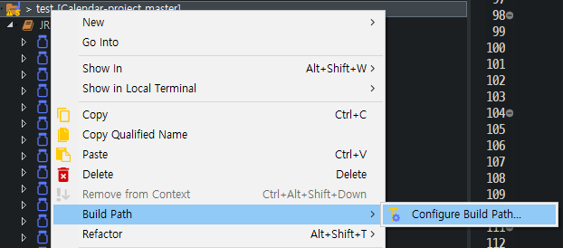

# POI로 Excel 다루기

## 1. Java

### 1.1 라이브러리 다운로드

- [http://poi.apache.org/download.html](http://poi.apache.org/download.html) 에서 `zip` 파일 선택

  

- 다운로드

  

- 압축 해제

  
### 1.2 라이브러리 추가

- Java 프로젝트의 우클릭 **Build Path** 진입

  

- 라이브러리 import, **xlsx 파일 또한 읽고 쓴다면 ooxml-lib의 라이브러리 포함**

  

- 같은 방식으로 [commons-collections](http://commons.apache.org/proper/commons-collections/download_collections.cgi), [commons-compress](http://commons.apache.org/proper/commons-compress/download_compress.cgi) 추가

### 1.3 Parsing


- 예제 Excel 파일은 위와 같음
- Excel 파일은 xlsx로 2007 이후 버전(XSSF)사용하고, 2007 이전 버전(HSSF)은 사용

#### 1.3.1 File Load

```java
FileInputStream fis = new FileInputStream("파일 경로");
XSSFWorkbook workbook = new XSSFWorkbook(fis);
```

#### 1.3.2 Sheet Count

```java
int sheetCount = workbook.getNumberOfSheets();
```

#### 1.3.3 Sheet 정보

```java
for(int sheetNo = 0; sheetNo < sheetCount; sheetNo++) {
	workbook.setActiveSheet(sheetNo);
	XSSFSheet sheet = workbook.getSheetAt(sheetNo);
	String sheetName = sheet.getSheetName();
	SheetVisibility sheetState = workbook.getSheetVisibility(sheetNo);
				
	System.out.println(sheetNo + ", " + sheetName + ", " + sheetState);
}
```

- **setActiveSheet(`int sheetIdx`)** - Sheet 활성화

  ```java
  workbook.setActiveSheet(sheetNo);
  ```

- **getSheetAt(`int sheetIdx`)** - 활성화된 Sheet 가져오기

  ```java
  XSSFSheet sheet = workbook.getSheetAt(sheetNo);
  ```

- **getSheetName()** - Sheet명

  ```java
  String sheetName = sheet.getSheetName();
  ```

- **getSheetVisibility(`int sheetIdx`)** - Sheet 상태

  ```java
  SheetVisibility sheetState = workbook.getSheetVisibility(sheetNo);
  ```

#### 1.3.4 마지막 행과 열 번호 구하기

```java
int lowestRow = sheet.getFirstRowNum();	// 첫 행
int highestRow = sheet.getLastRowNum();	// 마지막 행

// 각 행의 마지막 열 번호 구하기
for(int i = lowestRow; i < highestRow; i++) {
	int highestColumn = sheet.getRow(i).getLastCellNum();	// 각 행의 마지막 열
}
```

- **getFirstRowNum()** - 유효한 첫번째 행

  ```java
  int lowestRow = sheet.getFirstRowNum();
  ```

- **getLastRowNum()** - 유효한 마지막 행

  ```java
  int highestRow = sheet.getLastRowNum();
  ```

- **getLastCellNum()** - 행의 유효한 마지막 열

  ```java
  int highestColumn = sheet.getRow(i).getLastCellNum();
  ```

#### 1.3.5 표 데이터 Header 구하기

```java
int maxIndex = sheet.getRow(curRow).getLastCellNum();
			
ArrayList<String> headerList = new ArrayList<String>();
for (int i = 1; i < maxIndex; i++) {
	headerList.add(sheet.getRow(curRow).getCell(i).toString());
}
System.out.println(headerList);
```

```
[Date, 필드1, 필드2]
```

#### 1.3.6 표 데이터 Value  구하기

```java
ArrayList<ArrayList<Object>> valueList = new ArrayList<ArrayList<Object>>();
				
curRow++;
				
while (curRow <= highestRow) {
	ArrayList<Object> tmpList = new ArrayList<Object>();
					
	for (int i = 1; i < maxIndex; i++) {
		String value = sheet.getRow(curRow).getCell(i).toString();
						
		if (i == 1) {	// 첫번째 열 날짜 처리 필요
			SimpleDateFormat oldFormat = new SimpleDateFormat("dd-M월-yyyy");
			SimpleDateFormat newFormat = new SimpleDateFormat("yyyy-MM-dd");
			tmpList.add(newFormat.format(oldFormat.parse(value)));
		} else {	// 데이터 처리
			tmpList.add(Float.parseFloat(value));
		}
	}
	valueList.add(tmpList);
	curRow++;
}
System.out.println(valueList);
```

```
[[2020-01-01, 10.0, 124.0], [2020-01-02, 14.0, 112.0], [2020-01-03, 27.0, 195.0], ...]
```

#### 1.3.7 SQL Data화 하기

- 먼저 일치 시켜줄 Column명 Map 선언

  ```java
  HashMap<String, String> title = new HashMap<String, String>();
  title.put("Date", "ad_date");
  title.put("필드1", "f1");
  title.put("필드2", "f2");
  ```

- 함수 생성

  ```java
  private static void printSQLData(ArrayList<String> headerList, ArrayList<ArrayList<String>> valueList,
  			HashMap<String, String> title) {
  	ArrayList<String> transHeaderList = new ArrayList<String>();
  	for (String header : headerList) {
  		transHeaderList.add(title.get(header));
  	}
  		
  	String strHeader = String.join(", ", transHeaderList);
  
  	ArrayList<String> valuesList = new ArrayList<String>();
  	for (ArrayList<String> row : valueList) {
  		String strValue = "'" + String.join("', '", row) + "'";
  		valuesList.add("(" + strValue + ")");
  	}
  
  	System.out.println(strHeader + "\t" + String.join(", ", valuesList));
  }
  ```

  ```
  ad_date, f1, f2	('2020-01-01', '10.0', '124.0'), ('2020-01-02', '14.0', '112.0'), ('2020-01-03', '27.0', '195.0'), ...
  ```

#### 1.3.8 Refactor

- 메인 코드

  ```java
  public static void main(String[] args) {
  	try {
  		FileInputStream fis = new FileInputStream("경로");
  
  		XSSFWorkbook workbook = new XSSFWorkbook(fis);
  
  		int sheetCount = workbook.getNumberOfSheets();
  
  		for (int sheetNo = 0; sheetNo < sheetCount; sheetNo++) {
  			workbook.setActiveSheet(sheetNo);
  			XSSFSheet sheet = workbook.getSheetAt(sheetNo);
  			String sheetName = sheet.getSheetName();
  			SheetVisibility sheetState = workbook.getSheetVisibility(sheetNo);
  
  			System.out.println(sheetNo + ", " + sheetName + ", " + sheetState);
  
  			parse(sheet);
  		}
  	} catch (Exception e) {
  		e.printStackTrace();
  	}
  }
  ```

- parse 함수

  ```java
  private static void parse(XSSFSheet sheet) throws ParseException {
  	int curRow = sheet.getFirstRowNum(); // 첫 행
  	int highestRow = sheet.getLastRowNum(); // 마지막 행
  
  	int maxIndex = sheet.getRow(curRow).getLastCellNum();
  
  	ArrayList<String> headerList = new ArrayList<String>();
  	for (int i = 1; i < maxIndex; i++) {
  		headerList.add(sheet.getRow(curRow).getCell(i).toString());
  	}
  	System.out.println(headerList);
  
      ArrayList<ArrayList<String>> valueList = new ArrayList<ArrayList<String>>();
  
  	curRow++;
  
  	while (curRow <= highestRow) {
  		ArrayList<String> tmpList = new ArrayList<String>();
  
  		for (int i = 1; i < maxIndex; i++) {
  			String value = sheet.getRow(curRow).getCell(i).toString();
  
  			if (i == 1) {
  				SimpleDateFormat oldFormat = new SimpleDateFormat("dd-M월-yyyy");
  				SimpleDateFormat newFormat = new SimpleDateFormat("yyyy-MM-dd");
  				tmpList.add(newFormat.format(oldFormat.parse(value)).toString());
  			} else {
  				tmpList.add(value);
  			}
  		}
  		valueList.add(tmpList);
  		curRow++;
  	}
  	System.out.println(valueList);
  
  	HashMap<String, String> title = new HashMap<String, String>();
  	title.put("Date", "ad_date");
  	title.put("필드1", "f1");
  	title.put("필드2", "f2");
  
      printSQLData(headerList, valueList, title);
  }
  ```

## 2. Spring

### 2.1 의존성 주입

```xml
<!-- https://mvnrepository.com/artifact/org.apache.poi/poi -->
<dependency>
	<groupId>org.apache.poi</groupId>
	<artifactId>poi</artifactId>
	<version>4.1.2</version>
</dependency>
<!-- https://mvnrepository.com/artifact/org.apache.poi/poi-ooxml -->
<dependency>
	<groupId>org.apache.poi</groupId>
	<artifactId>poi-ooxml</artifactId>
	<version>4.1.2</version>
</dependency>
```

- 나머지는 **Java**와 같음.

