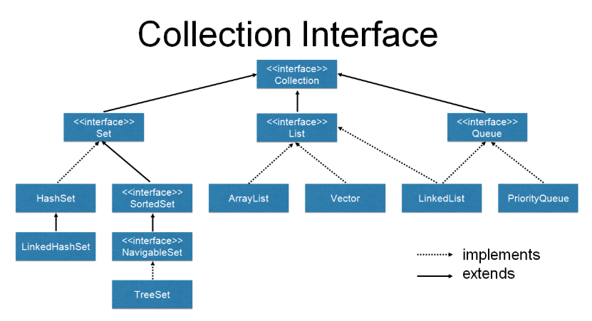

# 자바 성능 개선

참고: [제레미의 블로그](https://sungjk.github.io/2019/03/28/java-performance-tuning-1.html)

# 0. 메모리 사용량 확인하기

```java
Runtime.getRuntime().gc();
// 비교 직전에 gc 를 사용해서 garbage collection을 실행하도록 하면 보다 더 정확하게 메모리 소비량을 얻을 수 있다. 

long used = Runtime.getRuntime().totalMemory() - Runtime.getRuntime().freeMemory();

System.out.println("used memory is " + used + " bytes");
```

## 1. String 사용을 줄이자

- 일반적으로 쿼리 문장을 작성해보면, 다음과 같이 작성한다.

  ```java
  String strSQL = "";
  str += "select * ";
  str += "from ( ";
  str += "select A_column, ";
  str += "B_column, ";
  ...
  ```

- 이와 같이 String으로 코딩하면 다음과 같은 메모리 사용량을 확인 가능하다.

  |     구분      |       결과       |
  | :-----------: | :--------------: |
  | 메모리 사용량 | 10회 평균 약 5mb |
  |   응답 시간   | 10회 평균 약 5ms |

- 위 코드를 메모리 사용량과 응답 시간을 줄이기 위해 StringBuilder로 변경하자.

  ```java
  StringBuilder strSQL = new StringBuilder();
  strSQL.append("select * ");
  strSQL.append(" from ( ");
  strSQL.append(" select A_column, ");
  strSQL.append(" Bc_column, ");
  ...
  ```

- 이와 같이 StringBuilder를 이용해서 변경할 경우의 메모리 사용량과 응답 시간을 살펴보자.

  |     구분      |        결과        |
  | :-----------: | :----------------: |
  | 메모리 사용량 | 10회 평균 약 371kb |
  |   응답 시간   | 10회 평균 약 0.3ms |

### 1.1 StringBuffer 클래스 vs StringBuilder 클래스

- StringBuffer 클래스나 StringBuilder 클래스에서 제공하는 메서드는 동일하다.
- StringBuffer 클래스는 Thread에 안전하게(ThreadSafe) 설계되어 있으므로, **여러개의 Thread에서  하나의 StringBuffer 객체를 처리**해도 문제가 되지 않는다.
- **StringBuilder는 단일 Thread에서의 안전성만을 보장**한다.

### 1.2 String vs StringBuffer vs StringBuilder

> 그렇다면 String, StringBuffer, StringBuilder 세 개의 String 클래스에서 어느것이 가장 빠르고 메모리를 적게 사용하는지 알아보도록하자.

- 세가지 String 클래스를 이용하여 10,000 회 반복하여 문자열을 더하고, 이런 작업을 10회 반복해보면

  |     소스 코드     | 응답 시간(ms) | 소요시간 | 메모리 사용량(bytes) |  비고   |
  | :---------------: | :-----------: | :------: | :------------------: | :-----: |
  |   a += aValue;    |   95,801.41   |   95초   |   100,102,000,000    | 약 95gb |
  | b.append(aValue); |    247.48     |  0.25초  |      29,493,600      | 약 28mb |
  | c.append(cValue); |    174.17     |  0.17초  |      29,493,600      | 약 39mb |

- 왜 이러한 결과가 발생할까?

  ```java
  // String
  a += aValue
  ```

  1. 위와 같이 코딩하게  되면 더할때마다 새로운 String 객체가 만들어짐
  2. 이전에 있던 a **객체는 더이상 필요가 없어지므로 쓰레기 값이 되어 GC(GarbageCollector) 대상이 됨**
  3. **이러한 작업을 계속 반복하게 되면서 메모리를 많이 사용**하게 됨

- 그렇다면 **String**은 사용하지 말아야하나?

  - 아니다. **String 클래스는 짧은 문자열을 더할 경우** 사용하자.

- **StringBuffer**는 언제 사용해야하나?

  - Thread에 안전한 프로그램이 필요할때나, 개발 중인 시스템의 대부분이 **Thread에 안전한지를 모를 경우**
  - 만약 클래스에 **static으로 선언된 문자열을 변경**하거나, **singleton으로 선언된 클래스에 선언**된 경우

- **StrigBuilder**는 언제 사용해야하나?

  - Thread에 안전한지의 여부와 전혀 관계없는 프로그램을 개발할 경우
  - 만약, 메서드 내에 변수를 선언했다면, 그 변수는 그 메서드 내에서만 살아있으므로 StringBuilder를 사용

-----

## 2. 지금까지 사용하던 for 루프를 더 빠르게 사용해보자

- 기존의 for문과 size 메서드를 사용해서 사용하면 다음과 같았다.

  ```java
  for(int i = 0; i < list.size(); i++)
  ```

- 하지만 이렇게 사용하게 되면 **루프마다 size 메서드를 호출하기 때문에 성능 저하가 발생**한다.

- 그래서 이를 개선하기 위해서는 다음과 같이 코딩하는 것을 추천한다.

  ```java
  int listSize = list.size();
  for(int i = 0; i < listSize; i++)
  ```

-----

## 3. static을 제대로 사용하자

- 많은 클래스의 인스턴스를 생성하더라도, **static으로 선언된 변수나 메서드들을 동일한 주소값을 참조**한다.

## 3.1 static의 특징

- **다른 JVM**에서는 static으로 선언해도 **다른 주소나 다른 값을 참조**한다.
- 하지만 **하나의 JVM이나 WAS 인스턴스에서는 같은 주소에 존재하는 값을 참조**한다.
- 그래서 GC의 대상도 되지 않는다.

### 3.2 static 잘 사용하기

- 자주 사용하고 **절대 변하지 않는 변수는 final static으로 선언**하자
- 설정 파일 정보도 static으로 관리하자
- 코드성 데이터는 DB에서 한 번만 읽자

## 4. Collection 잘 사용하기



- **Collection : 가장 상위 인터페이스**

### 4.1 Set

- **중복이 불가능**하며 집합을 처리하는 인터페이스
  - **HashSet** : 데이터를 해쉬 테이블에 담는 클래스로 **순서 없이 저장**
  - **TreeSet** : **데이터를 담으면서 동시에 정렬**하기 떄문에 HashSet보다 느리다.
  - **LinkedHashSet** : 해쉬 테이블에 데이터를 담는데, 저**장된 순서에 따라서 순서가 결정**된다.
- **SortedSet** : **오름차순을 갖는 Set** 인터페이스

### 4.2 List

- **순서가 있는 인터페이스**이기 때문에 **인덱스가 존재하여 위치를 지정하여 값 검색이 가능**하다.

- List 인터페이스를 구현한 클래스들은 **담을 수 있는 크기가 자동으로 증가**되므로, **데이터의 개수를 확실히 모를 때 유용하게 사용**된다.

  - **Vector** : 객체 생성 시에 **크기를 지정할 필요가 없는 배열 클래스**
  - **ArrayList** : **Vector와 비슷하지만, 동기화 처리가 되어 있지 않다**.
  - **LinkedList** : ArrayList와 동일하지만, Queue 인터페이스를 구현했기 때문에 FIFO 작업 수행

- **단점** 

  - 데이터가 많은 경우 처리 시간이 늘어난다.

- 그렇다면 List 클래스 중에서 무엇이 빠른가?

  |      대상      | 평균 응답 시간(μs) |
  | :------------: | :----------------: |
  |   ArrayList    |         4          |
  |     Vector     |        105         |
  |   LinkedList   |       1,512        |
  | LinkedListPeek |        0.16        |

  - LinkedList는 Queue 인터페이스를 상속 받기 때문에, get) 보다는 순차적으로 결과를 ㅏㄷ아오는 peek()이나 poll() 메서드를 추천한다.
  - Vector는 여러 스레드에서 접근할 경우를 방지하기 위해 get() 메서드에 synchronized가 선언되어 있어서 성능 저하가 발생한다.

### 4.3 Map

- **키와 값의 쌍으로 구성된 객체의 집합을 처리하기 위한 인터페이스**, 키는 중복을 허용하지 않는다.
  - **HashTable** : 데이터를 해쉬 테이블에 담는 클래스
  - **HashMap** : 데이터를 해쉬 테이블에 담는 클래스. HashTable과는 다르게 null값을 허용하고 동기화되어 있지 않다.
  - **TreeMap** : red-black 트리에 데이터를 담는다. TreeSet과는 다르게 키에 의해 순서가 정해진다.
  - **LinkedHashMap** : HashMap과 거의 동일하며 이중 연결 리스트라는 방식을 사용하여 데이터를 담는다.
  - **SortedMap** : **키를 오름차순으로 정렬하는 Map 인터페이스**
- Map은 대부분의 클래스들의 속도가 동일하지만, 트리 형태로 처리하는 TreeMap 클래스가 가장 느리다.

### 4.4 Queue

- 여러 개의 객체를 처리하기 전에 담아서 처리할 때 사용하기 위한 인터페이스(**FIFO**) 
  - **PriorityQueue** : 큐에 추가된 순서와 상관없이 먼저 생성된 객체가 먼저 나오도록 되어 있는 큐
  - **LinkedBlockingQueue** : 저장할 데이터의 크기를 선택적으로 정할 수도 있는 FIFO 기반의 링크 노드를 사용하는 블로킹 Queue
    - Blocking Queue : 크기가 지정되어 있는 큐에 더 이상 공간이 없을 때, 공간이 생길 때까지 대기하도록 만들어진 큐
  - **ArrayBlockingQueue** : 저장되는 데이터의 크기가 정해져 있는 FIFO 기반의 블로킹 큐
  - **PriorityBlockingQueue** : 저장되는 데이터의 크기가 졍해져 있지 않고, 객체의 생성순서에 따라서 순서가 저장되는 블로킹 큐
  - **DelayQueue** : 큐가 대기하는 시간을 지정하여 처리하도록 되어 있는 큐
  - **SynchronousQueue** : put() 메서드를 호출하면, 다른 스레드에서 take() 메서드가 호출될 때까지 대기하도록 되어 있는 큐